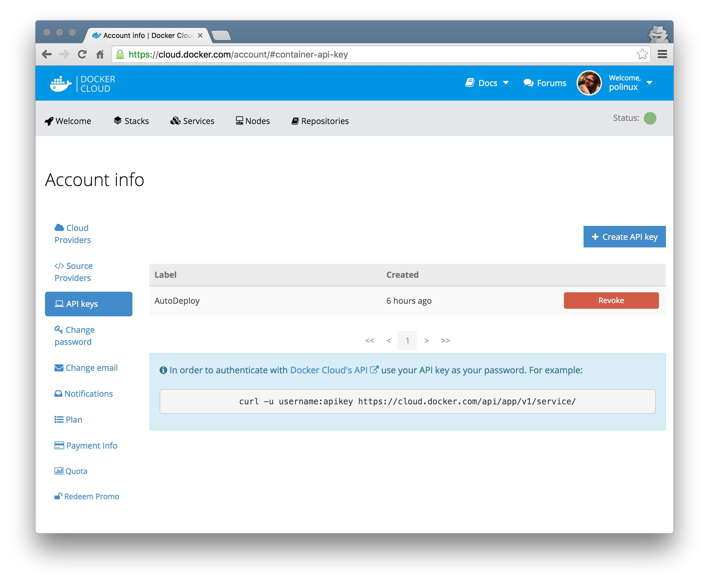
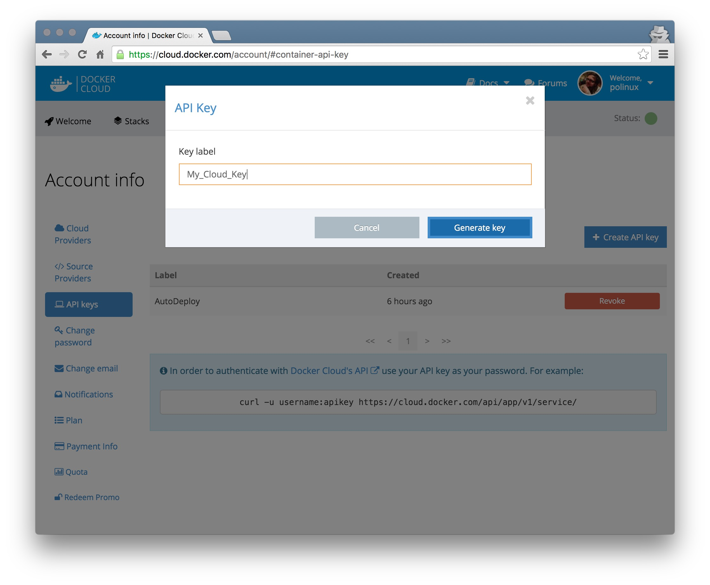
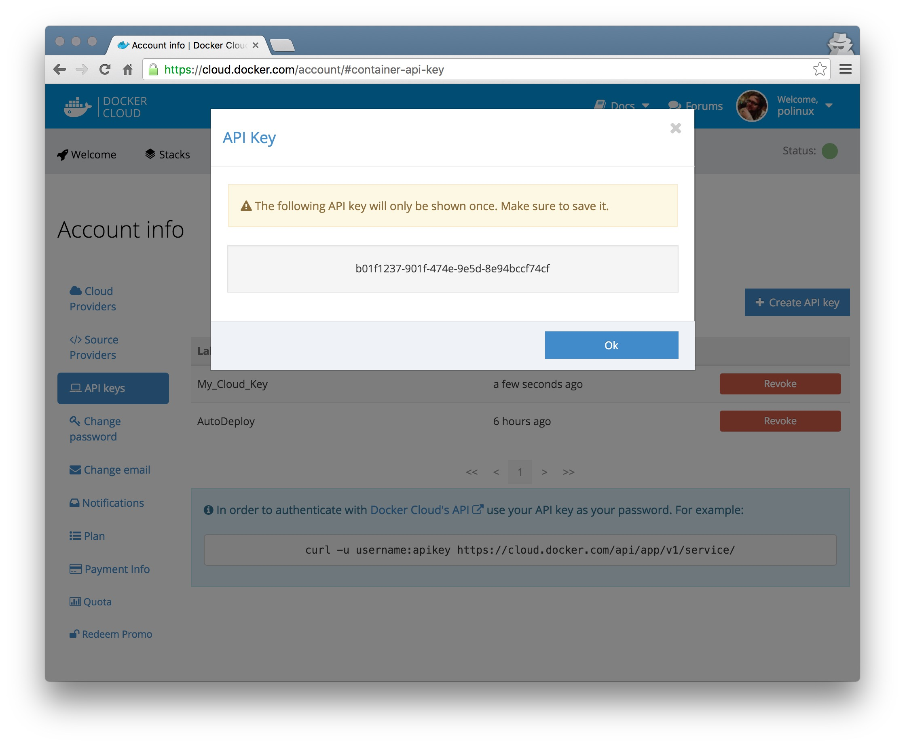
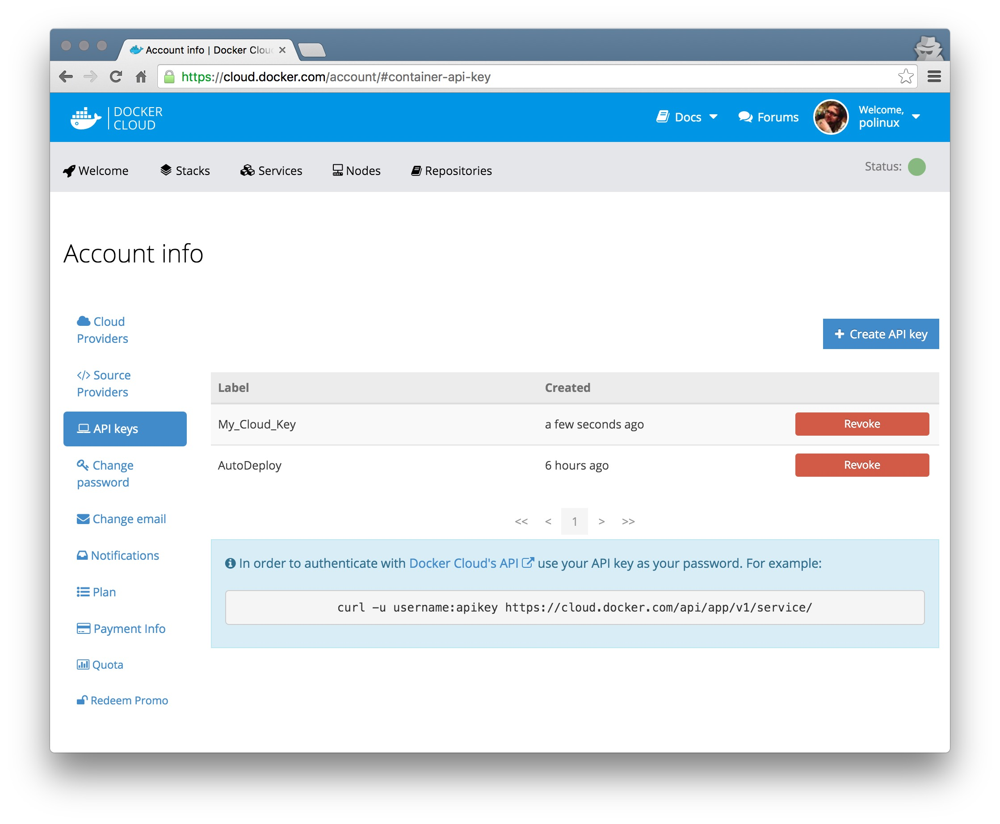
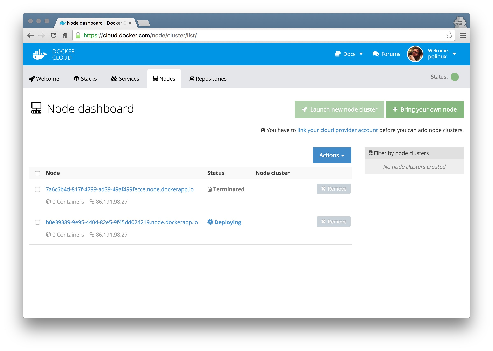
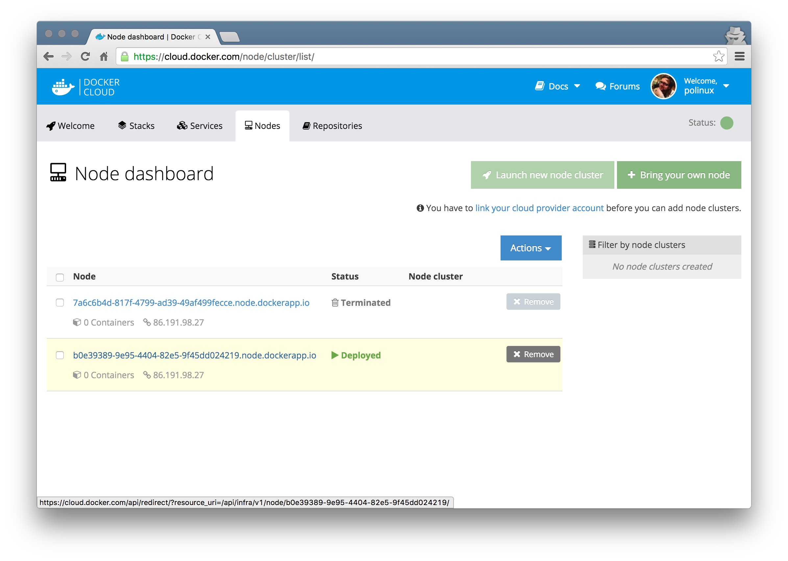
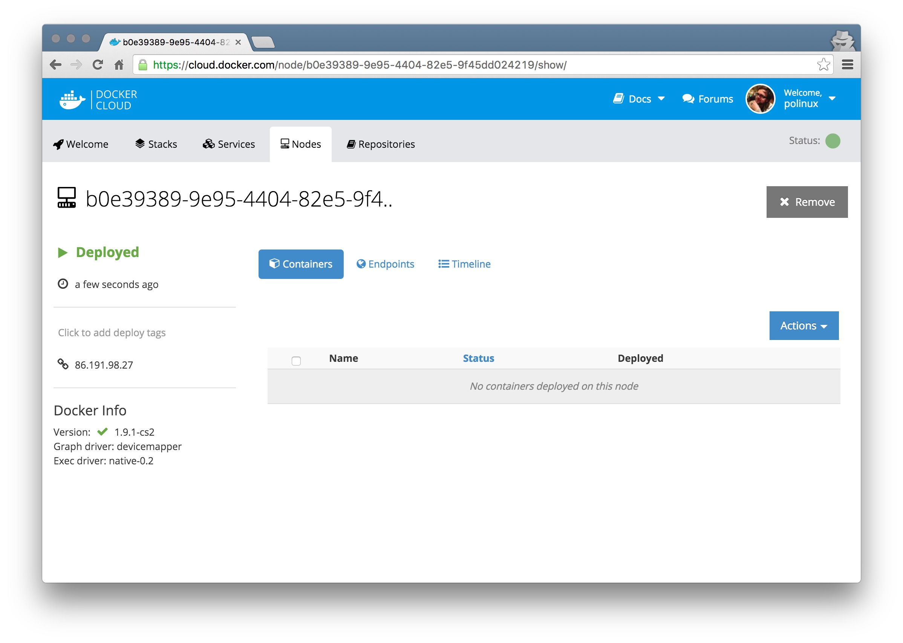

# Vagrant Docker Cloud node
In this repository you can find complete setup to deploy your Vagrant which will connect to Docker Cloud. In this example we will use [Vagrant](https://www.vagrantup.com/), [VirtualBox](https://www.virtualbox.org/), [CentoOS 7 Vagrant Box](https://atlas.hashicorp.com/pozgo/boxes/centos7) and [Ansible](https://www.ansible.com/) to automate whole process.

### Prerequisites
Programs needed:  
`vagrant`  
`VirtualBox`  
`Ansible`

### Docker Cloud API-Key
To be able to deploy new node inside of Docker Cloud infrastructure api-key is needed.
Go to Account Info in your Docker Cloud Web GUI.  

  

  

### Login Variables
Update file `group_vars/all` and fill with your newly generated API-Key and your username and email address.   
`docker_cloud_username` - docker login username  
`docker_cloud_api_key` - API-Key  

Example below:  

    ---
    docker_cloud_username: username
    docker_cloud_api_key: 339ca676-8afa-454e-9f68-1aa8cdd70521

### Vagrant VM specific options
User can tweak some settings if needed. (more RAM memory or CPU's)  
Edit `Vagrantfile` in root directory.  

    v.memory = 4096         # Ram Size
    v.cpus = 1              # Number of CPU's
    ip = "192.168.1.100"    # IP address virtual machine will be available in local network
    bridge: 'en0: Ethernet' # network interface that bridge should be used on. (i.e: eth0, ensp1s3)

### Run
After editing `docker_cloud_username` and `docker_cloud_api_key` start a virtual machine.  

    vagrant up

Video:  

New node added into Docker Cloud  

  

